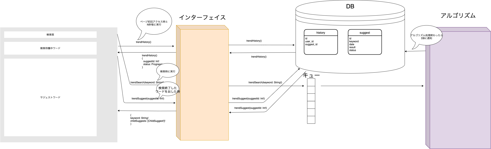

# TREND FIND フロントエンド

## 開発環境について
- Node.js v12.16.1

Docker環境を用意していますが、動作がとても遅いです。
ローカル環境で開発することをおすすめします。

## 事前準備
nodebrew等を利用して、Node.js v12.16.1 をインストール

## 環境構築
1. `npm ci`
2. `npm run dev`  

スタブに接続する場合は、`npm run dev`ではなく、`npm run stub`を実行する

http://localhost:3000 にアクセス  
ホットリロードに対応しているため、コード変更時に自動的に反映される。

## Makefile
- `make up.front` [フロントエンド]Docker環境起動
- `make run.local.front` [フロントエンド]ローカル環境実行
- `make run.eslint` ESLintの実行
- `make run.stub` GraphQLスタブ

## シーケンス図

